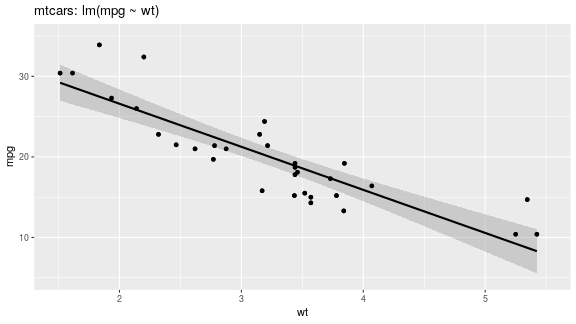

## Reproducible Pitch
### Bernd Meyer
#### May 6 2020

---

## Why Reproducible Reports?

- Allows others to replicate the results and independently verify the results.
- Replication is the highest standard in science.

---
## How?

- [Literate Programming](https://en.wikipedia.org/wiki/Literate_programming)
- Executable source code snippets are inlined in the report and woven together.
- It's supported in many programming languages.
- For instance in R we have [R Markdown](http://rmarkdown.rstudio.com).

---

## R Markdown

- R Markdown combines executable code snippets in R and other programming languages with a narrative text to fully reproducible reports.

```r
round(pi * 42^2, 3)
```

```
## [1] 5541.769
```

---

## Plot Example


```r
plot(pressure, main="Vapor Pressure of Mercury 
     as a Function of Temperature")
```




